# SmartFix API - Complete Diagrams Collection

This document contains all architectural, business, and deployment diagrams for the SmartFix API platform.

## Table of Contents
1. [Business Architecture Diagrams](#business-architecture-diagrams)
2. [Software Architecture Diagrams](#software-architecture-diagrams)
3. [Deployment Architecture Diagrams](#deployment-architecture-diagrams)
4. [Data Flow Diagrams](#data-flow-diagrams)
5. [Security Architecture Diagrams](#security-architecture-diagrams)

---

## Business Architecture Diagrams

### Business Process Flow

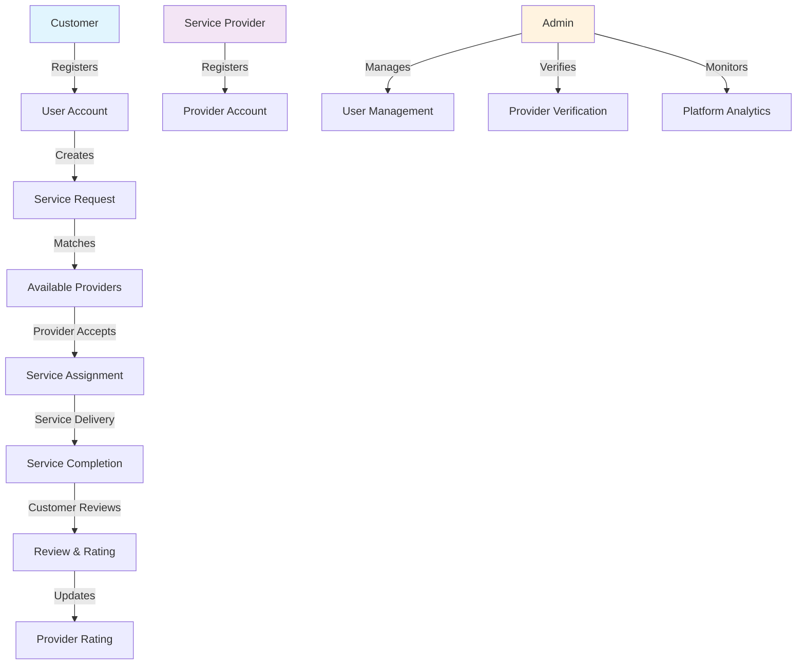
```mermaid
graph TD
    A[Customer] -->|Registers| B[User Account]
    C[Service Provider] -->|Registers| D[Provider Account]
    
    B -->|Creates| E[Service Request]
    E -->|Matches| F[Available Providers]
    F -->|Provider Accepts| G[Service Assignment]
    
    G -->|Service Delivery| H[Service Completion]
    H -->|Customer Reviews| I[Review & Rating]
    I -->|Updates| J[Provider Rating]
    
    K[Admin] -->|Manages| L[User Management]
    K -->|Verifies| M[Provider Verification]
    K -->|Monitors| N[Platform Analytics]
    
    style A fill:#e1f5fe
    style C fill:#f3e5f5
    style K fill:#fff3e0
```

### Customer Journey Map

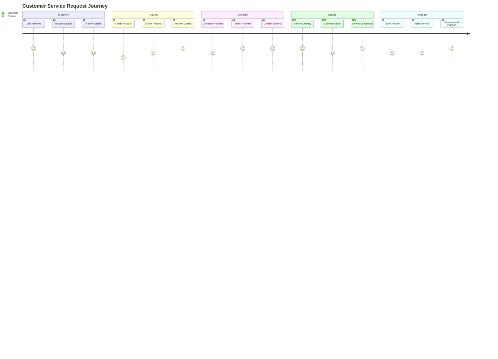
```mermaid
journey
    title Customer Service Request Journey
    section Discovery
      Visit Platform: 5: Customer
      Browse Services: 4: Customer
      View Providers: 4: Customer
    section Request
      Create Account: 3: Customer
      Submit Request: 4: Customer
      Receive Quotes: 5: Customer
    section Selection
      Compare Providers: 4: Customer
      Select Provider: 5: Customer
      Confirm Booking: 5: Customer
    section Service
      Service Delivery: 5: Customer, Provider
      Communication: 4: Customer, Provider
      Service Completion: 5: Customer, Provider
    section Feedback
      Leave Review: 4: Customer
      Rate Service: 4: Customer
      Recommend Platform: 5: Customer
```

### Business Model Canvas

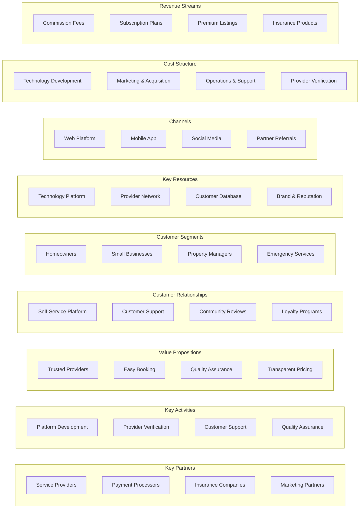
```mermaid
graph LR
    subgraph "Key Partners"
        A1[Service Providers]
        A2[Payment Processors]
        A3[Insurance Companies]
        A4[Marketing Partners]
    end
    
    subgraph "Key Activities"
        B1[Platform Development]
        B2[Provider Verification]
        B3[Customer Support]
        B4[Quality Assurance]
    end
    
    subgraph "Value Propositions"
        C1[Trusted Providers]
        C2[Easy Booking]
        C3[Quality Assurance]
        C4[Transparent Pricing]
    end
    
    subgraph "Customer Relationships"
        D1[Self-Service Platform]
        D2[Customer Support]
        D3[Community Reviews]
        D4[Loyalty Programs]
    end
    
    subgraph "Customer Segments"
        E1[Homeowners]
        E2[Small Businesses]
        E3[Property Managers]
        E4[Emergency Services]
    end
    
    subgraph "Key Resources"
        F1[Technology Platform]
        F2[Provider Network]
        F3[Customer Database]
        F4[Brand & Reputation]
    end
    
    subgraph "Channels"
        G1[Web Platform]
        G2[Mobile App]
        G3[Social Media]
        G4[Partner Referrals]
    end
    
    subgraph "Cost Structure"
        H1[Technology Development]
        H2[Marketing & Acquisition]
        H3[Operations & Support]
        H4[Provider Verification]
    end
    
    subgraph "Revenue Streams"
        I1[Commission Fees]
        I2[Subscription Plans]
        I3[Premium Listings]
        I4[Insurance Products]
    end
```

### Service Categories

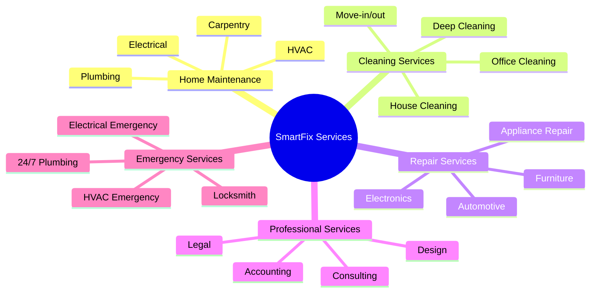
```mermaid
mindmap
  root((SmartFix Services))
    Home Maintenance
      Plumbing
      Electrical
      HVAC
      Carpentry
    Cleaning Services
      House Cleaning
      Office Cleaning
      Deep Cleaning
      Move-in/out
    Repair Services
      Appliance Repair
      Electronics
      Furniture
      Automotive
    Professional Services
      Legal
      Accounting
      Consulting
      Design
    Emergency Services
      24/7 Plumbing
      Electrical Emergency
      Locksmith
      HVAC Emergency
```

### Revenue Model

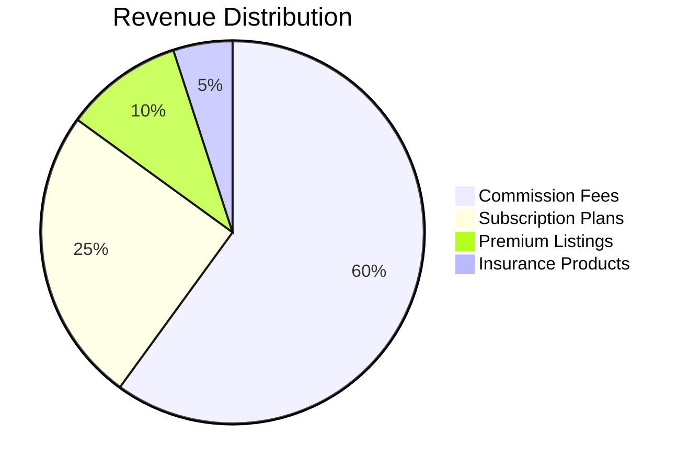
```mermaid
pie title Revenue Distribution
    "Commission Fees" : 60
    "Subscription Plans" : 25
    "Premium Listings" : 10
    "Insurance Products" : 5
```

---

## Software Architecture Diagrams

### System Architecture Overview

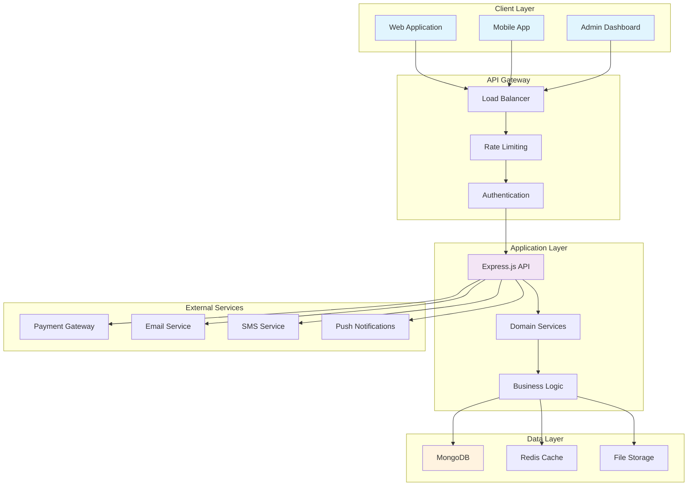
```mermaid
graph TB
    subgraph "Client Layer"
        A[Web Application]
        B[Mobile App]
        C[Admin Dashboard]
    end
    
    subgraph "API Gateway"
        D[Load Balancer]
        E[Rate Limiting]
        F[Authentication]
    end
    
    subgraph "Application Layer"
        G[Express.js API]
        H[Domain Services]
        I[Business Logic]
    end
    
    subgraph "Data Layer"
        J[MongoDB]
        K[Redis Cache]
        L[File Storage]
    end
    
    subgraph "External Services"
        M[Payment Gateway]
        N[Email Service]
        O[SMS Service]
        P[Push Notifications]
    end
    
    A --> D
    B --> D
    C --> D
    
    D --> E
    E --> F
    F --> G
    
    G --> H
    H --> I
    
    I --> J
    I --> K
    I --> L
    
    G --> M
    G --> N
    G --> O
    G --> P
    
    style A fill:#e1f5fe
    style B fill:#e1f5fe
    style C fill:#e1f5fe
    style G fill:#f3e5f5
    style J fill:#fff3e0
```

### Domain-Driven Design Architecture

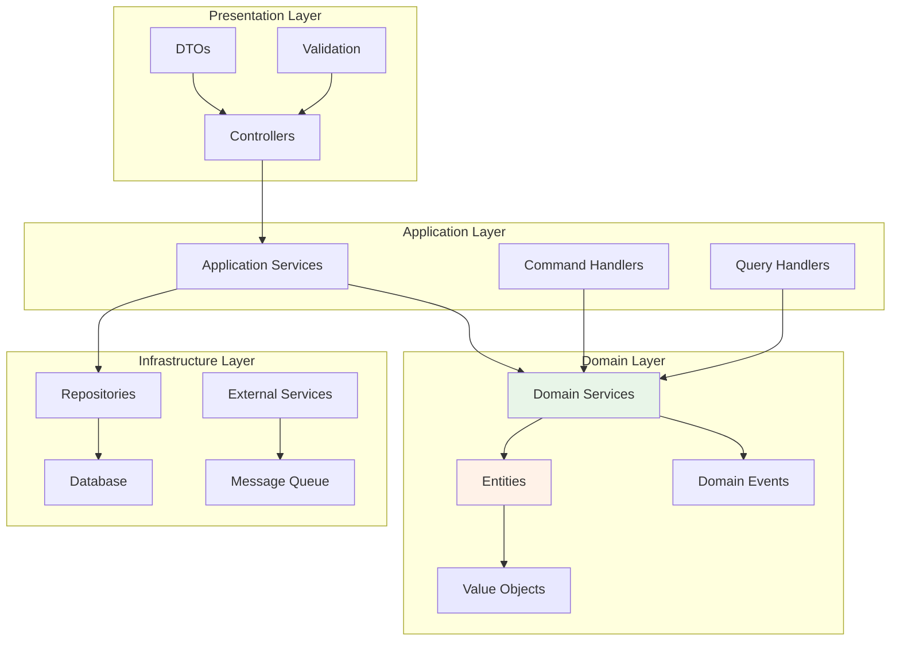
```mermaid
graph TB
    subgraph "Presentation Layer"
        A[Controllers]
        B[DTOs]
        C[Validation]
    end
    
    subgraph "Application Layer"
        D[Application Services]
        E[Command Handlers]
        F[Query Handlers]
    end
    
    subgraph "Domain Layer"
        G[Domain Services]
        H[Entities]
        I[Value Objects]
        J[Domain Events]
    end
    
    subgraph "Infrastructure Layer"
        K[Repositories]
        L[External Services]
        M[Database]
        N[Message Queue]
    end
    
    A --> D
    B --> A
    C --> A
    
    D --> G
    E --> G
    F --> G
    
    G --> H
    H --> I
    G --> J
    
    D --> K
    K --> M
    L --> N
    
    style G fill:#e8f5e8
    style H fill:#fff2e8
    style I fill:#e8e8ff
```

### Component Architecture

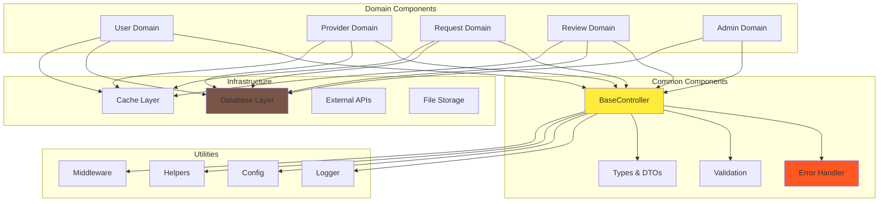
```mermaid
graph TB
    subgraph "Common Components"
        A[BaseController]
        B[Error Handler]
        C[Validation]
        D[Types & DTOs]
    end
    
    subgraph "Domain Components"
        E[User Domain]
        F[Provider Domain]
        G[Request Domain]
        H[Review Domain]
        I[Admin Domain]
    end
    
    subgraph "Infrastructure"
        J[Database Layer]
        K[Cache Layer]
        L[External APIs]
        M[File Storage]
    end
    
    subgraph "Utilities"
        N[Logger]
        O[Config]
        P[Helpers]
        Q[Middleware]
    end
    
    E --> A
    F --> A
    G --> A
    H --> A
    I --> A
    
    A --> B
    A --> C
    A --> D
    
    E --> J
    F --> J
    G --> J
    H --> J
    I --> J
    
    E --> K
    F --> K
    G --> K
    H --> K
    
    A --> N
    A --> O
    A --> P
    A --> Q
    
    style A fill:#ffeb3b
    style B fill:#ff5722
    style J fill:#795548
```

### API Architecture

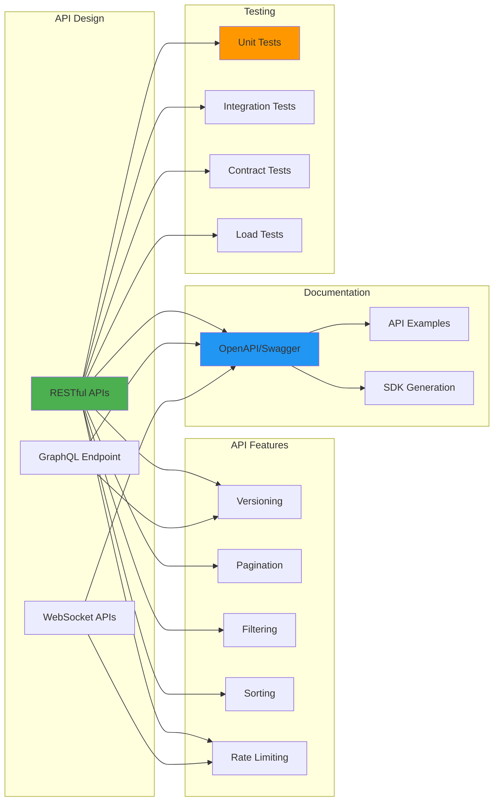
```mermaid
graph LR
    subgraph "API Design"
        A[RESTful APIs]
        B[GraphQL Endpoint]
        C[WebSocket APIs]
    end
    
    subgraph "API Features"
        D[Versioning]
        E[Pagination]
        F[Filtering]
        G[Sorting]
        H[Rate Limiting]
    end
    
    subgraph "Documentation"
        I[OpenAPI/Swagger]
        J[API Examples]
        K[SDK Generation]
    end
    
    subgraph "Testing"
        L[Unit Tests]
        M[Integration Tests]
        N[Contract Tests]
        O[Load Tests]
    end
    
    A --> D
    A --> E
    A --> F
    A --> G
    A --> H
    
    B --> D
    C --> H
    
    A --> I
    B --> I
    C --> I
    
    I --> J
    I --> K
    
    A --> L
    A --> M
    A --> N
    A --> O
    
    style A fill:#4caf50
    style I fill:#2196f3
    style L fill:#ff9800
```

---

## Deployment Architecture Diagrams

### Cloud Infrastructure Overview

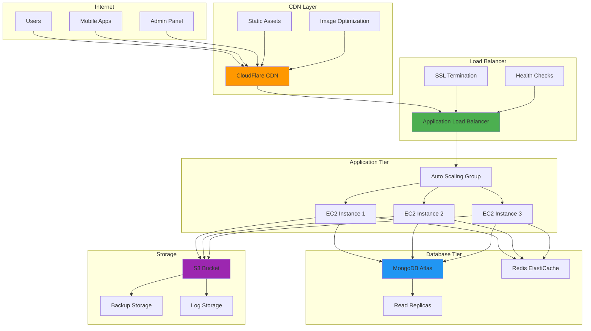
```mermaid
graph TB
    subgraph "Internet"
        A[Users]
        B[Mobile Apps]
        C[Admin Panel]
    end
    
    subgraph "CDN Layer"
        D[CloudFlare CDN]
        E[Static Assets]
        F[Image Optimization]
    end
    
    subgraph "Load Balancer"
        G[Application Load Balancer]
        H[SSL Termination]
        I[Health Checks]
    end
    
    subgraph "Application Tier"
        J[Auto Scaling Group]
        K[EC2 Instance 1]
        L[EC2 Instance 2]
        M[EC2 Instance 3]
    end
    
    subgraph "Database Tier"
        N[MongoDB Atlas]
        O[Redis ElastiCache]
        P[Read Replicas]
    end
    
    subgraph "Storage"
        Q[S3 Bucket]
        R[Backup Storage]
        S[Log Storage]
    end
    
    A --> D
    B --> D
    C --> D
    
    D --> G
    E --> D
    F --> D
    
    G --> J
    H --> G
    I --> G
    
    J --> K
    J --> L
    J --> M
    
    K --> N
    L --> N
    M --> N
    
    K --> O
    L --> O
    M --> O
    
    N --> P
    
    K --> Q
    L --> Q
    M --> Q
    
    Q --> R
    Q --> S
    
    style D fill:#ff9800
    style G fill:#4caf50
    style N fill:#2196f3
    style Q fill:#9c27b0
```

### Kubernetes Deployment

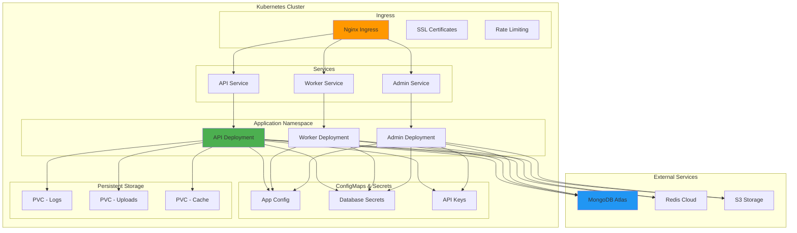
```mermaid
graph TB
    subgraph "Kubernetes Cluster"
        subgraph "Ingress"
            A[Nginx Ingress]
            B[SSL Certificates]
            C[Rate Limiting]
        end
        
        subgraph "Application Namespace"
            D[API Deployment]
            E[Worker Deployment]
            F[Admin Deployment]
        end
        
        subgraph "Services"
            G[API Service]
            H[Worker Service]
            I[Admin Service]
        end
        
        subgraph "ConfigMaps & Secrets"
            J[App Config]
            K[Database Secrets]
            L[API Keys]
        end
        
        subgraph "Persistent Storage"
            M[PVC - Logs]
            N[PVC - Uploads]
            O[PVC - Cache]
        end
    end
    
    subgraph "External Services"
        P[MongoDB Atlas]
        Q[Redis Cloud]
        R[S3 Storage]
    end
    
    A --> G
    A --> H
    A --> I
    
    G --> D
    H --> E
    I --> F
    
    D --> J
    D --> K
    D --> L
    
    E --> J
    E --> K
    
    F --> J
    F --> K
    F --> L
    
    D --> M
    D --> N
    D --> O
    
    D --> P
    D --> Q
    D --> R
    
    E --> P
    E --> Q
    
    F --> P
    F --> R
    
    style A fill:#ff9800
    style D fill:#4caf50
    style P fill:#2196f3
```

### CI/CD Pipeline

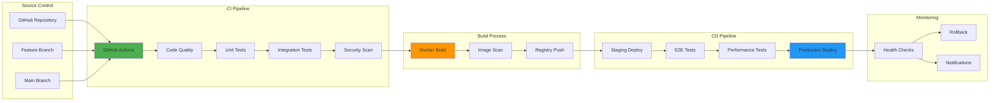
```mermaid
graph LR
    subgraph "Source Control"
        A[GitHub Repository]
        B[Feature Branch]
        C[Main Branch]
    end
    
    subgraph "CI Pipeline"
        D[GitHub Actions]
        E[Code Quality]
        F[Unit Tests]
        G[Integration Tests]
        H[Security Scan]
    end
    
    subgraph "Build Process"
        I[Docker Build]
        J[Image Scan]
        K[Registry Push]
    end
    
    subgraph "CD Pipeline"
        L[Staging Deploy]
        M[E2E Tests]
        N[Performance Tests]
        O[Production Deploy]
    end
    
    subgraph "Monitoring"
        P[Health Checks]
        Q[Rollback]
        R[Notifications]
    end
    
    A --> D
    B --> D
    C --> D
    
    D --> E
    E --> F
    F --> G
    G --> H
    
    H --> I
    I --> J
    J --> K
    
    K --> L
    L --> M
    M --> N
    N --> O
    
    O --> P
    P --> Q
    P --> R
    
    style D fill:#4caf50
    style I fill:#ff9800
    style O fill:#2196f3
```

---

## Data Flow Diagrams

### Request Processing Flow

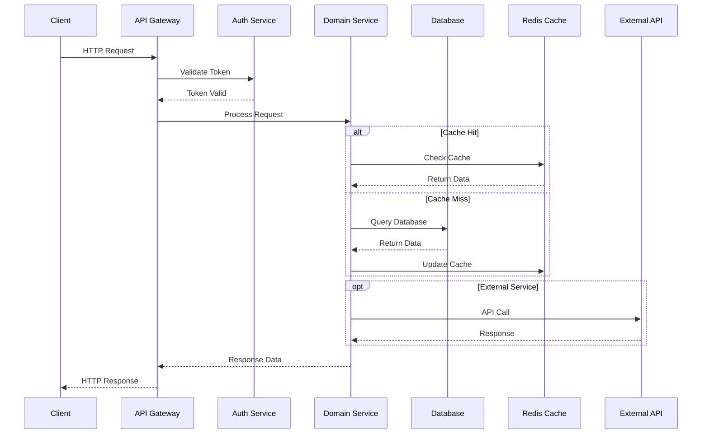
```mermaid
sequenceDiagram
    participant C as Client
    participant G as API Gateway
    participant A as Auth Service
    participant S as Domain Service
    participant D as Database
    participant R as Redis Cache
    participant E as External API
    
    C->>G: HTTP Request
    G->>A: Validate Token
    A-->>G: Token Valid
    G->>S: Process Request
    
    alt Cache Hit
        S->>R: Check Cache
        R-->>S: Return Data
    else Cache Miss
        S->>D: Query Database
        D-->>S: Return Data
        S->>R: Update Cache
    end
    
    opt External Service
        S->>E: API Call
        E-->>S: Response
    end
    
    S-->>G: Response Data
    G-->>C: HTTP Response
```

### Service Request Lifecycle

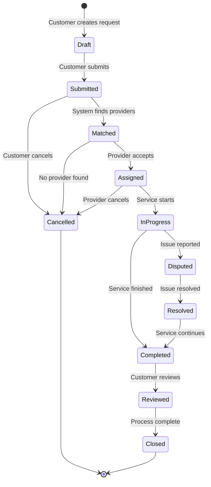
```mermaid
stateDiagram-v2
    [*] --> Draft: Customer creates request
    Draft --> Submitted: Customer submits
    Submitted --> Matched: System finds providers
    Matched --> Assigned: Provider accepts
    Assigned --> InProgress: Service starts
    InProgress --> Completed: Service finished
    Completed --> Reviewed: Customer reviews
    Reviewed --> Closed: Process complete
    
    Submitted --> Cancelled: Customer cancels
    Matched --> Cancelled: No provider found
    Assigned --> Cancelled: Provider cancels
    InProgress --> Disputed: Issue reported
    Disputed --> Resolved: Issue resolved
    Resolved --> Completed: Service continues
    
    Cancelled --> [*]
    Closed --> [*]
```

### Data Synchronization Flow

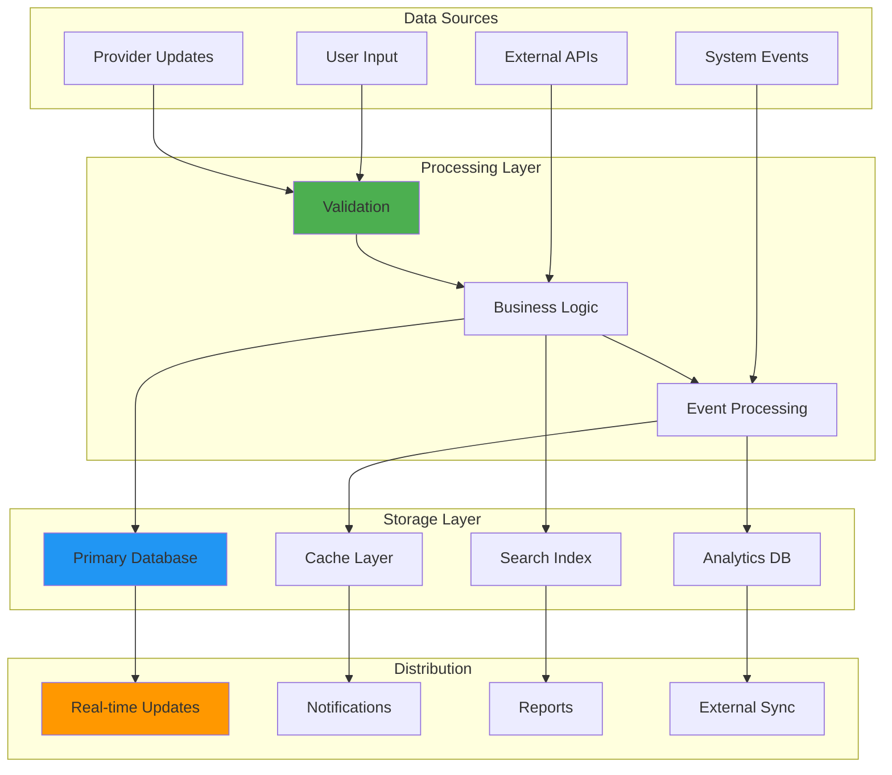
```mermaid
graph TB
    subgraph "Data Sources"
        A[User Input]
        B[Provider Updates]
        C[System Events]
        D[External APIs]
    end
    
    subgraph "Processing Layer"
        E[Validation]
        F[Business Logic]
        G[Event Processing]
    end
    
    subgraph "Storage Layer"
        H[Primary Database]
        I[Cache Layer]
        J[Search Index]
        K[Analytics DB]
    end
    
    subgraph "Distribution"
        L[Real-time Updates]
        M[Notifications]
        N[Reports]
        O[External Sync]
    end
    
    A --> E
    B --> E
    C --> G
    D --> F
    
    E --> F
    F --> G
    
    F --> H
    G --> I
    F --> J
    G --> K
    
    H --> L
    I --> M
    J --> N
    K --> O
    
    style E fill:#4caf50
    style H fill:#2196f3
    style L fill:#ff9800
```

---

## Security Architecture Diagrams

### Security Layers

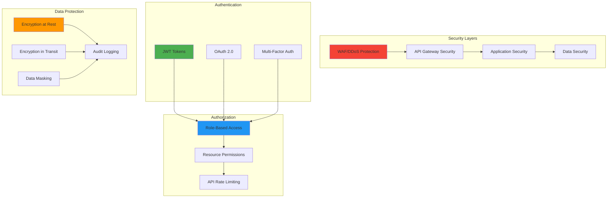
```mermaid
graph TB
    subgraph "Security Layers"
        A[WAF/DDoS Protection]
        B[API Gateway Security]
        C[Application Security]
        D[Data Security]
    end
    
    subgraph "Authentication"
        E[JWT Tokens]
        F[OAuth 2.0]
        G[Multi-Factor Auth]
    end
    
    subgraph "Authorization"
        H[Role-Based Access]
        I[Resource Permissions]
        J[API Rate Limiting]
    end
    
    subgraph "Data Protection"
        K[Encryption at Rest]
        L[Encryption in Transit]
        M[Data Masking]
        N[Audit Logging]
    end
    
    A --> B
    B --> C
    C --> D
    
    E --> H
    F --> H
    G --> H
    
    H --> I
    I --> J
    
    K --> N
    L --> N
    M --> N
    
    style A fill:#f44336
    style E fill:#4caf50
    style H fill:#2196f3
    style K fill:#ff9800
```

### Authentication Flow

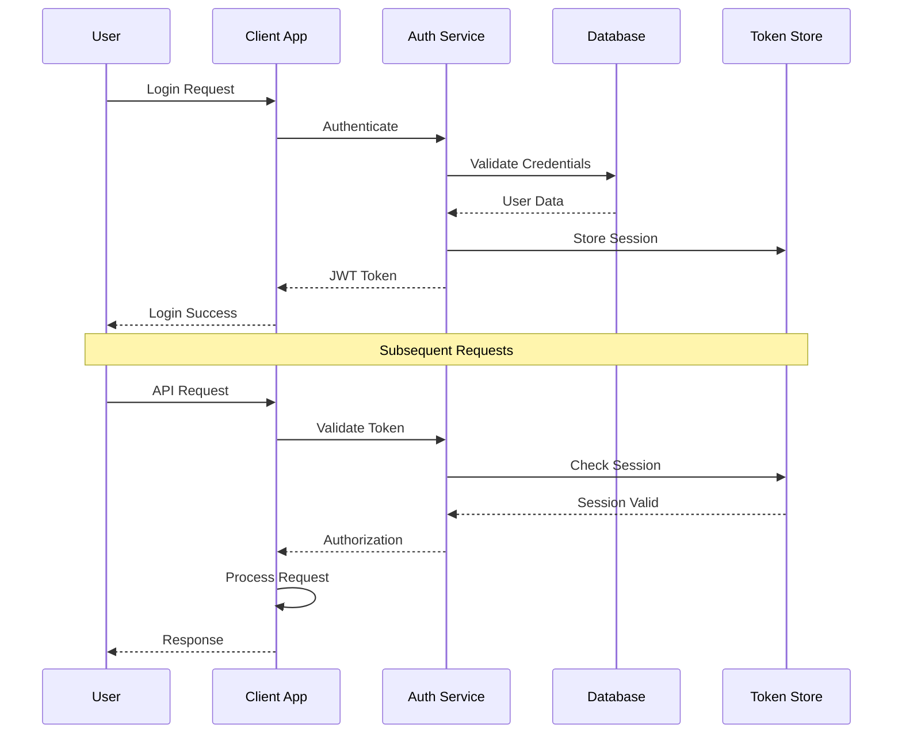
```mermaid
sequenceDiagram
    participant U as User
    participant C as Client App
    participant A as Auth Service
    participant D as Database
    participant T as Token Store
    
    U->>C: Login Request
    C->>A: Authenticate
    A->>D: Validate Credentials
    D-->>A: User Data
    A->>T: Store Session
    A-->>C: JWT Token
    C-->>U: Login Success
    
    Note over U,T: Subsequent Requests
    U->>C: API Request
    C->>A: Validate Token
    A->>T: Check Session
    T-->>A: Session Valid
    A-->>C: Authorization
    C->>C: Process Request
    C-->>U: Response
```

### Network Security

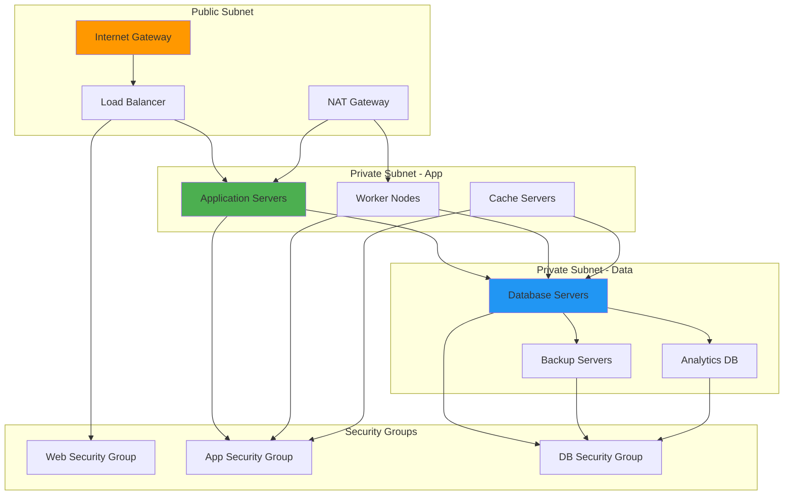
```mermaid
graph TB
    subgraph "Public Subnet"
        A[Internet Gateway]
        B[Load Balancer]
        C[NAT Gateway]
    end
    
    subgraph "Private Subnet - App"
        D[Application Servers]
        E[Worker Nodes]
        F[Cache Servers]
    end
    
    subgraph "Private Subnet - Data"
        G[Database Servers]
        H[Backup Servers]
        I[Analytics DB]
    end
    
    subgraph "Security Groups"
        J[Web Security Group]
        K[App Security Group]
        L[DB Security Group]
    end
    
    A --> B
    B --> D
    C --> D
    C --> E
    
    D --> G
    E --> G
    F --> G
    
    G --> H
    G --> I
    
    B --> J
    D --> K
    E --> K
    F --> K
    
    G --> L
    H --> L
    I --> L
    
    style A fill:#ff9800
    style D fill:#4caf50
    style G fill:#2196f3
```

---

## Monitoring and Observability

### Monitoring Architecture

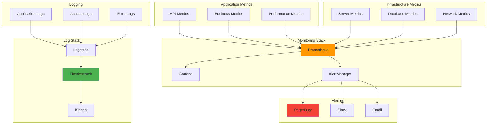
```mermaid
graph TB
    subgraph "Application Metrics"
        A[API Metrics]
        B[Business Metrics]
        C[Performance Metrics]
    end
    
    subgraph "Infrastructure Metrics"
        D[Server Metrics]
        E[Database Metrics]
        F[Network Metrics]
    end
    
    subgraph "Logging"
        G[Application Logs]
        H[Access Logs]
        I[Error Logs]
    end
    
    subgraph "Monitoring Stack"
        J[Prometheus]
        K[Grafana]
        L[AlertManager]
    end
    
    subgraph "Log Stack"
        M[Elasticsearch]
        N[Logstash]
        O[Kibana]
    end
    
    subgraph "Alerting"
        P[PagerDuty]
        Q[Slack]
        R[Email]
    end
    
    A --> J
    B --> J
    C --> J
    
    D --> J
    E --> J
    F --> J
    
    J --> K
    J --> L
    
    G --> N
    H --> N
    I --> N
    
    N --> M
    M --> O
    
    L --> P
    L --> Q
    L --> R
    
    style J fill:#ff9800
    style M fill:#4caf50
    style P fill:#f44336
```

### Performance Monitoring

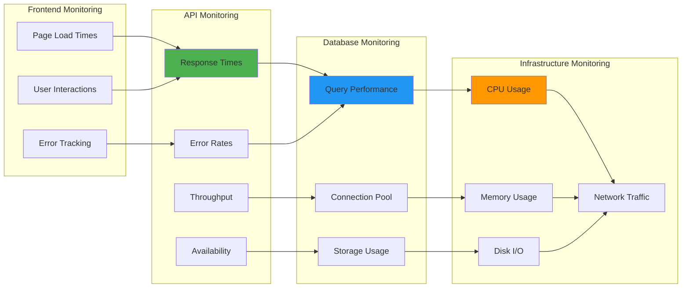
```mermaid
graph LR
    subgraph "Frontend Monitoring"
        A[Page Load Times]
        B[User Interactions]
        C[Error Tracking]
    end
    
    subgraph "API Monitoring"
        D[Response Times]
        E[Throughput]
        F[Error Rates]
        G[Availability]
    end
    
    subgraph "Database Monitoring"
        H[Query Performance]
        I[Connection Pool]
        J[Storage Usage]
    end
    
    subgraph "Infrastructure Monitoring"
        K[CPU Usage]
        L[Memory Usage]
        M[Disk I/O]
        N[Network Traffic]
    end
    
    A --> D
    B --> D
    C --> F
    
    D --> H
    E --> I
    F --> H
    G --> J
    
    H --> K
    I --> L
    J --> M
    
    K --> N
    L --> N
    M --> N
    
    style D fill:#4caf50
    style H fill:#2196f3
    style K fill:#ff9800
```

---

## Disaster Recovery

### Backup and Recovery Strategy

```mermaid
graph TB
    subgraph "Primary Region"
        A[Production Cluster]
        B[Primary Database]
        C[Application Data]
    end
    
    subgraph "Secondary Region"
        D[Standby Cluster]
        E[Replica Database]
        F[Backup Data]
    end
    
    subgraph "Backup Strategy"
        G[Daily Backups]
        H[Point-in-Time Recovery]
        I[Cross-Region Replication]
    end
    
    subgraph "Recovery Process"
        J[Failover Automation]
        K[DNS Switching]
        L[Data Synchronization]
    end
    
    A --> D
    B --> E
    C --> F
    
    B --> G
    B --> H
    B --> I
    
    A --> J
    J --> K
    J --> L
    
    E --> L
    F --> L
    
    style A fill:#4caf50
    style D fill:#ff9800
    style J fill:#f44336
```

---

This comprehensive diagrams collection provides visual documentation for all aspects of the SmartFix API platform, from business processes to technical implementation details. These diagrams serve as both documentation and communication tools for stakeholders, developers, and operations teams.

